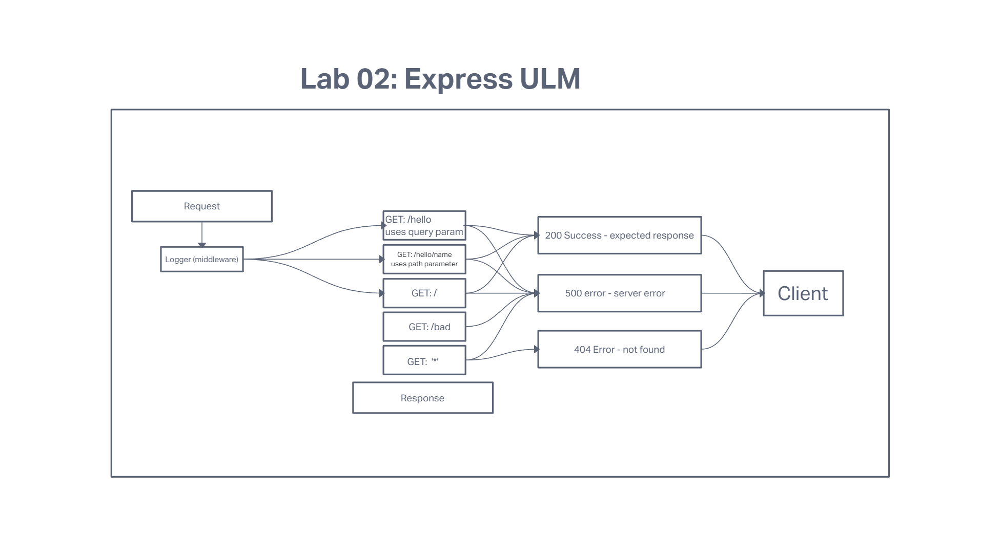

# LAB - 02: Express

## Author: Tyler Main

[tests-report](https://github.com/TylerofArk/server-deployment-practice/actions)

## Links and Resources

[Production Server](https://tlm-basic-express-server.herokuapp.com/)

## Problem Domain
A basic express server inteded to practice server modularization, use of middleware, writing tests and overall best practices.

### Dependencies

- node
- dotenv
- express
- jest
- supertest

#### Setup

- npm init
- env
- npm i dotenv, supertest, jest, express

#### Tests

[Test Report](https://github.com/TylerofArk/basic-express-server/actions/runs/3095211306/jobs/5009386993)

##### UML

###### Collaborators

Luis Rosales
